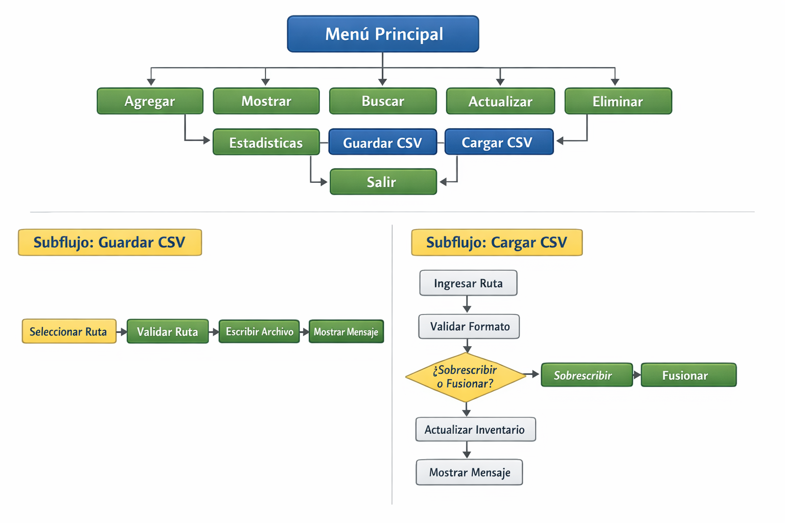

# Sistema de Gestión de Inventario

Este es un sencillo sistema de gestión de inventario basado en la consola, desarrollado en Python. Permite a los usuarios administrar un inventario de productos, incluyendo funcionalidades para agregar, ver, buscar, actualizar y eliminar productos. Además, ofrece la capacidad de guardar y cargar el inventario desde y hacia archivos CSV, y proporciona estadísticas básicas sobre el inventario.

## Características

- **Agregar productos:** Añade nuevos productos al inventario especificando su nombre, precio y cantidad.
- **Mostrar inventario:** Visualiza una lista completa de todos los productos en el inventario, junto con sus precios y cantidades.
- **Buscar productos:** Busca un producto específico por su nombre.
- **Actualizar productos:** Modifica el precio y/o la cantidad de un producto existente.
- **Eliminar productos:** Elimina un producto del inventario.
- **Estadísticas del inventario:** Muestra estadísticas clave como el número total de unidades, el valor total del inventario, el producto más caro y el producto con mayor stock.
- **Persistencia de datos:** Guarda el estado actual del inventario en un archivo CSV y lo carga de nuevo cuando es necesario.

## Cómo ejecutar la aplicación

Para iniciar la aplicación, simplemente ejecuta el siguiente comando en tu terminal desde el directorio raíz del proyecto:

```bash
python main.py
```

Aparecerá un menú en la consola con todas las opciones disponibles.

## Estructura del código

El proyecto está organizado en varios módulos para separar las responsabilidades y mejorar la mantenibilidad:

- **`main.py`**: Es el punto de entrada principal de la aplicación. Contiene el bucle principal que muestra el menú, captura la entrada del usuario y llama a las funciones correspondientes.

- **`funtions/`**: Este directorio contiene los módulos que encapsulan la lógica de la aplicación.
    - **`app.py`**: Define las funciones que interactúan directamente con el usuario. Muestra el menú, solicita datos y llama a las funciones de servicio para ejecutar las acciones.
    - **`servicios.py`**: Contiene la lógica de negocio principal para la gestión del inventario. Aquí se definen las funciones para agregar, actualizar, eliminar, buscar productos y calcular estadísticas.
    - **`archivos.py`**: Se encarga de la lectura y escritura de archivos CSV, permitiendo guardar y cargar el inventario.
    - **`extras.py`**: Proporciona funciones de utilidad, como limpiar la pantalla de la consola, y define constantes de color para mejorar la interfaz de usuario.

## Diagrama de flujo



---

## _links de los videos y sitios que tome  como ayuda para el desarrollo del proyecto_

link 1
- https://youtu.be/iXv4bBG3qKc?si=SU8uAbVUD-zkq24l

link 2
- https://youtu.be/LYdsJ88e_ag?si=5Qi3yHbXtlfhtGFk

link 3
- https://talkingwithdata.medium.com/c%C3%B3mo-cargar-un-archivo-csv-en-python-considerando-sus-caracter%C3%ADsticas-5cb0ca74e9d
